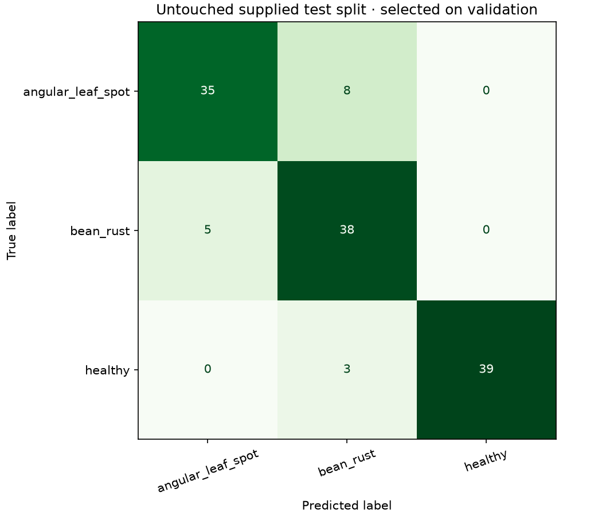
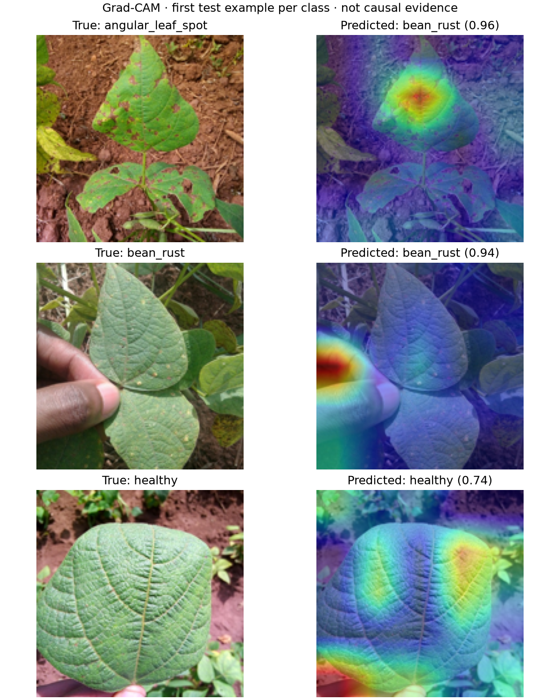

# Plant Disease Detection — Bean Field Photos

A CPU-reproducible comparison of a compact CNN and frozen MobileNet transfer learning on real, expert-annotated bean-leaf photos.



## Problem and objective

Classify three represented bean-leaf conditions: angular leaf spot, bean rust and healthy. The engineering goal is a validated training-to-inference workflow with honest uncertainty and error analysis. This research demo has no agronomic diagnosis validation or open-world disease detection capability.

## Dataset and provenance

[Makerere AI Lab / NaCRRI Beans](https://github.com/AI-Lab-Makerere/ibean): smartphone field photos from Uganda, labeled by crop researchers. The official supplied partitions contain 1,034 training, 133 validation and 128 test images, three classes. The source README lists 1,296 images, whereas the downloaded partitions contain **1,295**; the study uses the actual archives. Original GCS URLs returned HTTP 403; the download script uses the dataset owner's [Hugging Face mirror](https://huggingface.co/datasets/AI-Lab-Makerere/beans), pinned to commit `27aa014ce09b193e1a6f58112d4a66e0eddb69c5`.

The [download manifest](data/source-manifest.json) pins SHA-256 hashes and URLs. Source images are MIT-licensed; preserve [the original licence](data/SOURCE-LICENSE.txt) and credit Makerere AI Lab/NaCRRI. Raw photos and model weights remain local and ignored by Git. All example photos shown here derive from that source.

The [audit](reports/data-audit.json) found no exact decoded-pixel duplicates and no cross-partition dHash pairs at distance ≤5. This is screening, **not proof of plant/farm independence**: those identifiers are unavailable. Geographic or independent-farm performance remains unmeasured.

## Workflow and model selection

```text
Hash-verified archives → supplied partitions / duplicate audit → 160 px normalization
→ CNN train augmentation / frozen ImageNet MobileNet features + train flip views
→ validation epoch and architecture selection → validation temperature calibration
→ one test evaluation → Grad-CAM, probability metrics → local inference API
```

Seed 42, two CPU threads, deterministic PyTorch algorithms. CNN: three convolutional blocks, global pooling, dropout, 8 epochs, Adam 0.001, training-only random flips. Transfer model: MobileNetV3 Small `IMAGENET1K_V1` backbone frozen in evaluation mode, pooled 576-dimensional features from original/flipped training views, dropout + three-class linear head, 50 epochs Adam 0.005. Epoch and architecture are selected by validation macro-F1; no tuning after test inspection. Temperature minimizes validation negative log-likelihood in a predefined interval [0.05, 5]. Validation is used for both selection and calibration, so its scores are not independent estimates.

## Actual results

| Model | Validation macro-F1 | Test macro-F1 | Test accuracy |
|---|---:|---:|---:|
| small_cnn | 0.6767 | 0.6365 | 0.6484 |
| mobilenet_transfer | 0.9108 | 0.8775 | 0.8750 |

Selected: **mobilenet_transfer**. Temperature: 1.286. Calibrated test log loss: 0.3174; multiclass Brier: 0.1758; 10-bin ECE: 0.0491. These estimates use only 128 test images and the supplied split; no broader field-validity claim follows. Full [metrics/history](reports/metrics.json), [per-class results](reports/classification-report.json) and [test probabilities](reports/test-predictions.csv) are stored.

A predeclared Gaussian blur radius 2 + brightness factor 0.7 check yields macro-F1 **0.7705**. Altering the same test images is a robustness check, not an independent domain-shift dataset. Low ECE does not establish out-of-distribution rejection or reliable confidence for other crops.

## Explainability



The first test image per true class is selected deterministically, retaining errors. The angular-leaf-spot example is misclassified as rust with probability 0.96, and the rust example highlights a thumb/background region. These are reasons to investigate shortcut learning, not evidence of reliable lesion recognition. Grad-CAM targets each predicted class in the last feature map. A highlighted region reflects sensitivity of that model score; it is neither a causal explanation nor a lesion annotation.

## Reproduce and serve

Python 3.12; CPU PyTorch wheels. In a source clone:

```bash
python -m venv .venv
# Activate .venv using your platform's command.
python -m pip install -r requirements-lock.txt
python -m pip install --no-deps -e .
python -m plantvision.train
python -m pytest -q
python -m uvicorn app.api:app --host 127.0.0.1 --port 8001
```

Open `/docs` for the local API. POST `/predict` accepts `{"image_base64":"..."}`, rejects extra fields, invalid images, unsupported dimensions and images over 3 MB, and returns all three probabilities. `/health` returns 503 until the local artifact exists. State dictionaries are loaded with `weights_only=True`. Training downloads approximately 180 MB of source archives and 10 MB of pretrained weights. Internet is required for a first reproduction. Source archive ZIPs and trained weights are excluded from Git and the release source ZIP.

`src/plantvision`: acquisition/audit, architectures, training, inference. `app`: FastAPI. `configs`: fixed experiment. `reports`: executed outputs. `notebooks`: executed evidence inspection. `tests`: mathematical, image and service contracts. See [data notes](data/README.md), [verification](docs/verification.md), [French learning guide](docs/learning-guide.md), [interview notes](docs/interview-notes.md) and [design](docs/design.md).

## Limits and improvements

Only three bean conditions, one supplied dataset, no plant/farm metadata, no external farm holdout or expert-reviewed diagnosis. Same-image transformations do not substitute for external testing. Add farm-disjoint field data and additional disease/unknown classes, estimate sampling uncertainty, and validate abstention before using the output for a decision. Do not tune the existing test after seeing these results.

Developed with AI assistance. All displayed metrics and images are produced by executed code. Daily public publication and remote CI verification are still pending.


## GitHub publication

[Public repository](https://github.com/idrisslemnouni-crypto/plant-disease-detection) · [Current CI results](https://github.com/idrisslemnouni-crypto/plant-disease-detection/actions). Published following the user's explicit 5 October 2026 request to release the prepared portfolio together. Earlier local-verification notes describe the pre-publication checkpoint. Raw sources and trained artifacts remain excluded from Git; reproduction commands regenerate them.
